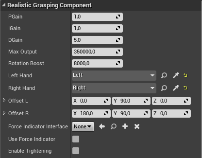
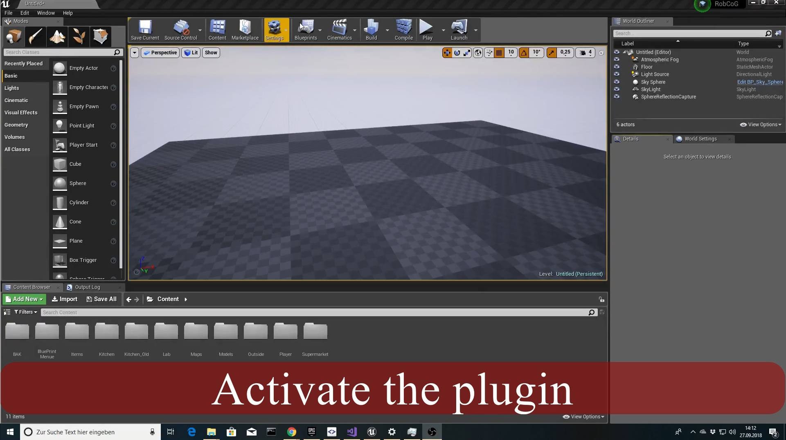
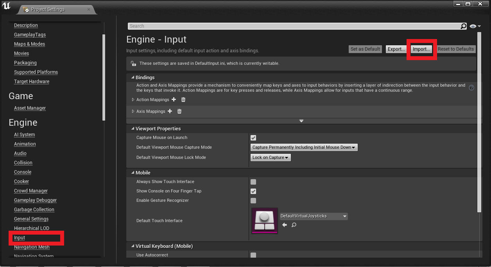

# Activate our plugin 

* First add our plugin into the plugin folder of your project

* Add also the **UPIDController** to your plugin folder. You can download it from here: [UPIDController] (https://github.com/robcog-iai/UPIDController)

* Last step is to activate both plugins.

# How to use our grasping component

* First of all you will need a character. You can use your own character or you can use an empty character.

* If you are using your own character and you already created a camera component and/or two motion controller components,
our grasping component will use these (He will not change anything to these components. Maybe you can get some problems with the position ore orientation). Otherwise, he will create default components for you and add this to the character.

* In this example we will use the empty character.

* Go to the model editor and search for the empty character (or your own) and drag it into the world.

* After this you will also need two hand actors. Go again to the model editor a search for **grasping hand** and drag two of them into the world.

* Select the both hands and select a mesh that you want to use. (The Mesh that you used for creating an animation and this mesh should be the same
(The mesh name is important to find all animations))

* Add both hands to the character

* Add also a camera component to your character (optional but recommend)

* Don't forget to set the auto possess player value to your player id

* You maybe also need to change the rotation offsets for both hands if the result didn't satisfy you.

* Also it can be happened, that the rotation and movement is a bit strange (maybe to slow or to fast or something else). Then you will have to change the values
**PGain**, **IGain**, **DGain**, **MaxOutput**, and the **RotationBoost**. For more information see this documentation: [UPIDController] (https://github.com/robcog-iai/UPIDController)

* Select the option **Enable Tightening** if you want to use [Tightening Grasp](./Documentation/TighteningGrasp.md)

* If you also want to visualize the force or to debug the force. [See force indicator documentation](/DokuForceIndicator.md)

* See also the video walkthrough for more details. (Click on the image below)

* That's it!

# Key Bindings

In order to grasp or to switch the grasping style you need to bind some keys for it.

* With **SwitchNextGrasp** and **SwitchPreviousGrasp** (for both hands) can you change your grasping style.

* With **NewGraspWithLeftHand** and **NewGraspWithRightHand** can you grasp something.

* With **resetPosition** can you reset your position

* You can also easily import our input data file to add them. Just got to the project settings, input and then import. The input file is located in our plugin config folder.

# Using physics materials for better performance

* Our plugin contains two physics materials, called **HighFriction** and **SuperLight**. 

* When applied to an object **HighFriction**  makes it heavy and gives it a high amount of friction. Use it for your hands. 

* **SuperLight** Makes your object light and also gives it a high amount of friction. Use this for objects you want to grasp. 
 
* We were unable to measure exactly how much friction influences the grasping. The difference in weight between hand and grasped object however is very important. 

# Problems and some Tipps

* It can be happened, that your hands are not at the right position (flying away or something like that) in this case use the reset button. You maybe also want to change some properties like PGain to get better results(see above).

* Be sure that there are existing grasps for your hand meshes otherwise you cannot grasp something.

* Start the game when you have the headset on your head and the controllers in your hand (it should reduce the problems with the hand locations).

* Although be sure that your character is not stuck in the ground or something else.

* If you are using your own character you will maybe have to change the relative locations for the camera and the motion controllers.

* Be sure that you set the auto possess player to your player ID.

* If the hands are moving with you when you are moving your head, try to add a camera component rather than using the default one that are created by the component

# Videos

- [video of us grasping multiple objects](https://www.youtube.com/watch?v=B3_VCXEQydY)
- [video showcasing the Tightening Grasp](https://www.youtube.com/watch?v=ReFS7ecV5rs)

